# [📈 Live Status](https://MBTechLabs.github.io/status): <!--live status--> **🟧 Partial outage**

This repository contains the open-source uptime monitor and status page for [Tech Labs](https://MBTechLabs.github.io/status), powered by [Upptime](https://github.com/upptime/upptime).

With [Upptime](https://upptime.js.org), you can get your own unlimited and free uptime monitor and status page, powered entirely by a GitHub repository. We use [Issues](https://github.com/MBTechLabs/status/issues) as incident reports, [Actions](https://github.com/MBTechLabs/status/actions) as uptime monitors, and [Pages](https://MBTechLabs.github.io/status) for the status page.

<!--start: status pages-->
<!-- This summary is generated by Upptime (https://github.com/upptime/upptime) -->
<!-- Do not edit this manually, your changes will be overwritten -->
<!-- prettier-ignore -->
| URL | Status | History | Response Time | Uptime |
| --- | ------ | ------- | ------------- | ------ |
|  [Kadjoe](https://kadjoe.com) | 🟩 Up | [kadjoe.yml](https://github.com/MBTechLabs/status/commits/HEAD/history/kadjoe.yml) | 

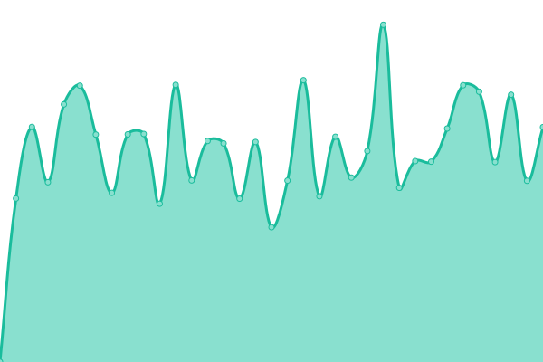 1048ms
     
 | 

<a href="https://MBTechLabs.github.io/status/history/kadjoe">96.84%</a>
    

|  [Sentrallab](https://sentrallabgenetik.co.id) | 🟩 Up | [sentrallab.yml](https://github.com/MBTechLabs/status/commits/HEAD/history/sentrallab.yml) | 

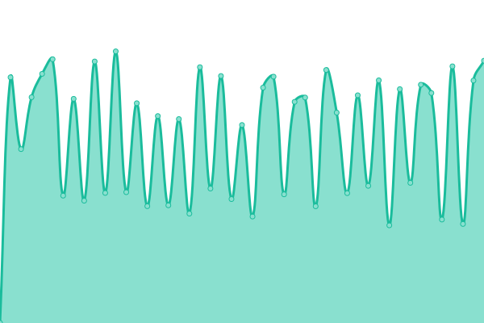 1688ms
     
 | 

<a href="https://MBTechLabs.github.io/status/history/sentrallab">96.84%</a>
    

|  [Soutbarn](https://southbarn.id) | 🟥 Down | [soutbarn.yml](https://github.com/MBTechLabs/status/commits/HEAD/history/soutbarn.yml) | 

 1773ms
     
 | 

<a href="https://MBTechLabs.github.io/status/history/soutbarn">83.48%</a>
    

|  [Pipaslg](https://pipaslg.com) | 🟥 Down | [pipaslg.yml](https://github.com/MBTechLabs/status/commits/HEAD/history/pipaslg.yml) | 

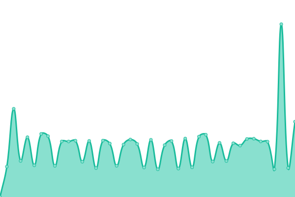 1761ms
     
 | 

<a href="https://MBTechLabs.github.io/status/history/pipaslg">96.38%</a>
    

|  [Trovee Studio](https://troveestudio.com) | 🟥 Down | [trovee-studio.yml](https://github.com/MBTechLabs/status/commits/HEAD/history/trovee-studio.yml) | 

 2556ms
     
 | 

<a href="https://MBTechLabs.github.io/status/history/trovee-studio">80.68%</a>
    

|  [Ballooney](https://ballooney.co.id) | 🟥 Down | [ballooney.yml](https://github.com/MBTechLabs/status/commits/HEAD/history/ballooney.yml) | 

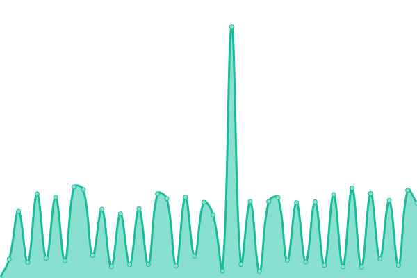 1467ms
     
 | 

<a href="https://MBTechLabs.github.io/status/history/ballooney">83.48%</a>
    

|  [Jaroemsadha](https://jaroemsadha.com) | 🟥 Down | [jaroemsadha.yml](https://github.com/MBTechLabs/status/commits/HEAD/history/jaroemsadha.yml) | 

 3479ms
     
 | 

<a href="https://MBTechLabs.github.io/status/history/jaroemsadha">83.49%</a>
    

|  [Decor House Indonesia](https://decorhouseindonesia.com) | 🟥 Down | [decor-house-indonesia.yml](https://github.com/MBTechLabs/status/commits/HEAD/history/decor-house-indonesia.yml) | 

 1497ms
     
 | 

<a href="https://MBTechLabs.github.io/status/history/decor-house-indonesia">83.50%</a>
    

|  [Somnum Chalets](https://somnumchalets.com) | 🟥 Down | [somnum-chalets.yml](https://github.com/MBTechLabs/status/commits/HEAD/history/somnum-chalets.yml) | 

 1592ms
     
 | 

<a href="https://MBTechLabs.github.io/status/history/somnum-chalets">30.93%</a>
    

|  [Sugar Filtrations Screen](https://sugarfiltrationscreens.com) | 🟥 Down | [sugar-filtrations-screen.yml](https://github.com/MBTechLabs/status/commits/HEAD/history/sugar-filtrations-screen.yml) | 

 1585ms
     
 | 

<a href="https://MBTechLabs.github.io/status/history/sugar-filtrations-screen">83.52%</a>
    

|  [Souma Movement](https://soumamovement.com) | 🟥 Down | [souma-movement.yml](https://github.com/MBTechLabs/status/commits/HEAD/history/souma-movement.yml) | 

 1630ms
     
 | 

<a href="https://MBTechLabs.github.io/status/history/souma-movement">83.53%</a>
    

|  [Carne Ristorante](https://carneristorante.com) | 🟥 Down | [carne-ristorante.yml](https://github.com/MBTechLabs/status/commits/HEAD/history/carne-ristorante.yml) | 

 2240ms
     
 | 

<a href="https://MBTechLabs.github.io/status/history/carne-ristorante">83.55%</a>
    

|  [Andsonsarana](https://andsonsarana.com) | 🟥 Down | [andsonsarana.yml](https://github.com/MBTechLabs/status/commits/HEAD/history/andsonsarana.yml) | 

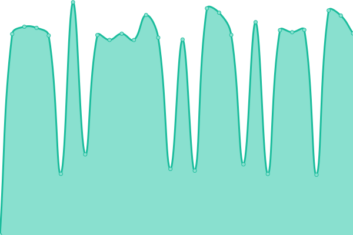 2578ms
     
 | 

<a href="https://MBTechLabs.github.io/status/history/andsonsarana">96.43%</a>
    

|  [Monelo](https://monelo.id) | 🟥 Down | [monelo.yml](https://github.com/MBTechLabs/status/commits/HEAD/history/monelo.yml) | 

 2298ms
     
 | 

<a href="https://MBTechLabs.github.io/status/history/monelo">83.57%</a>
    

|  [Melon](https://melonbranding.com) | 🟥 Down | [melon.yml](https://github.com/MBTechLabs/status/commits/HEAD/history/melon.yml) | 

 1927ms
     
 | 

<a href="https://MBTechLabs.github.io/status/history/melon">83.60%</a>
    

|  [Homecarefs](https://homecarefs.com.au) | 🟥 Down | [homecarefs.yml](https://github.com/MBTechLabs/status/commits/HEAD/history/homecarefs.yml) | 

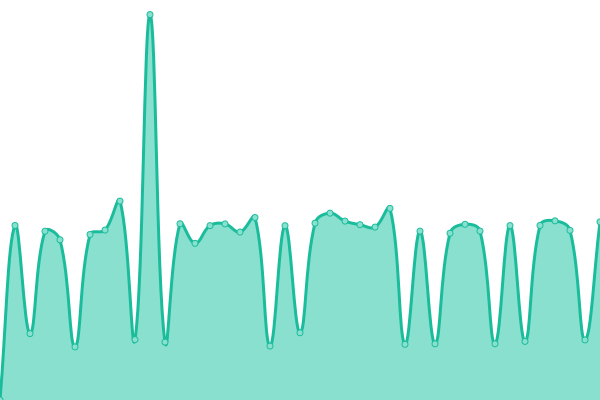 2496ms
     
 | 

<a href="https://MBTechLabs.github.io/status/history/homecarefs">96.48%</a>
    

|  [Pilates](https://pilatescapital.com) | 🟥 Down | [pilates.yml](https://github.com/MBTechLabs/status/commits/HEAD/history/pilates.yml) | 

 2170ms
     
 | 

<a href="https://MBTechLabs.github.io/status/history/pilates">96.48%</a>
    

|  [Inkprint](https://inkprint.id) | 🟥 Down | [inkprint.yml](https://github.com/MBTechLabs/status/commits/HEAD/history/inkprint.yml) | 

 1777ms
     
 | 

<a href="https://MBTechLabs.github.io/status/history/inkprint">96.48%</a>
    

|  [Karunia Utama](https://karuniautama.id) | 🟥 Down | [karunia-utama.yml](https://github.com/MBTechLabs/status/commits/HEAD/history/karunia-utama.yml) | 

 1060ms
     
 | 

<a href="https://MBTechLabs.github.io/status/history/karunia-utama">83.70%</a>
    

|  [Koalisi tubindo](https://koalisitubindo.com) | 🟥 Down | [koalisi-tubindo.yml](https://github.com/MBTechLabs/status/commits/HEAD/history/koalisi-tubindo.yml) | 

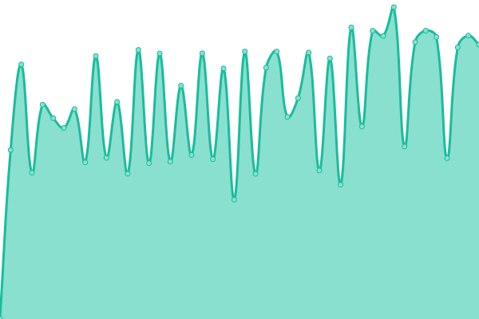 1712ms
     
 | 

<a href="https://MBTechLabs.github.io/status/history/koalisi-tubindo">82.93%</a>
    

|  [Heir Care Studio](https://heircarestudio.com) | 🟥 Down | [heir-care-studio.yml](https://github.com/MBTechLabs/status/commits/HEAD/history/heir-care-studio.yml) | 

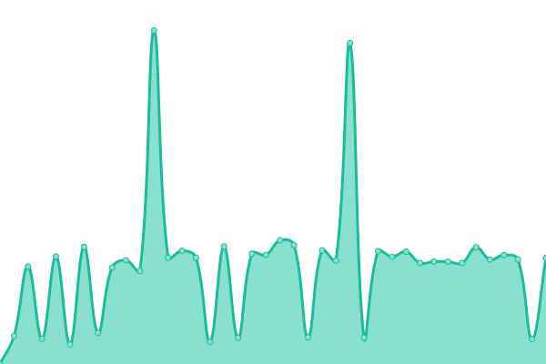 4088ms
     
 | 

<a href="https://MBTechLabs.github.io/status/history/heir-care-studio">82.08%</a>
    

|  [Buana Cahaya Abadi](https://buanacahayaabadi.com) | 🟥 Down | [buana-cahaya-abadi.yml](https://github.com/MBTechLabs/status/commits/HEAD/history/buana-cahaya-abadi.yml) | 

 1775ms
     
 | 

<a href="https://MBTechLabs.github.io/status/history/buana-cahaya-abadi">82.10%</a>
    

|  [Vitablitz](https://vitablitzherbal.com) | 🟥 Down | [vitablitz.yml](https://github.com/MBTechLabs/status/commits/HEAD/history/vitablitz.yml) | 

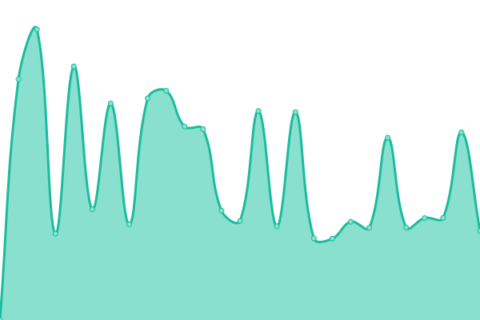 4068ms
     
 | 

<a href="https://MBTechLabs.github.io/status/history/vitablitz">83.87%</a>
    

|  [Direct Station](https://directstation.co.id) | 🟥 Down | [direct-station.yml](https://github.com/MBTechLabs/status/commits/HEAD/history/direct-station.yml) | 

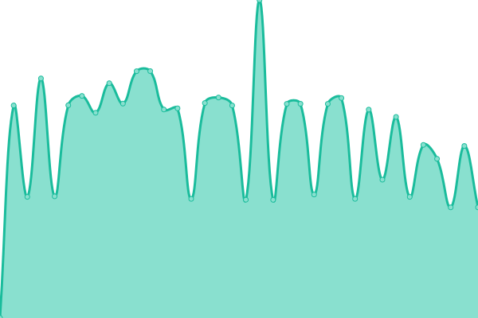 2617ms
     
 | 

<a href="https://MBTechLabs.github.io/status/history/direct-station">82.29%</a>
    

|  [Tiga Sumber Audio](https://tigasumberaudio.com) | 🟥 Down | [tiga-sumber-audio.yml](https://github.com/MBTechLabs/status/commits/HEAD/history/tiga-sumber-audio.yml) | 

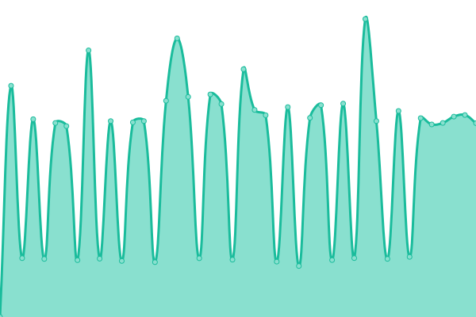 4341ms
     
 | 

<a href="https://MBTechLabs.github.io/status/history/tiga-sumber-audio">82.15%</a>
    

|  [Elora](https://elora.co.id) | 🟥 Down | [elora.yml](https://github.com/MBTechLabs/status/commits/HEAD/history/elora.yml) | 

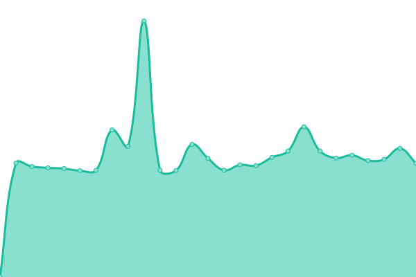 3497ms
     
 | 

<a href="https://MBTechLabs.github.io/status/history/elora">82.38%</a>
    

|  [Tiang Living](https://tiangliving.com) | 🟥 Down | [tiang-living.yml](https://github.com/MBTechLabs/status/commits/HEAD/history/tiang-living.yml) | 

 0ms
     
 | 

<a href="https://MBTechLabs.github.io/status/history/tiang-living">0.00%</a>
    

|  [Hamparan Harapan Hayati](https://hamparanharapanhayati.com) | 🟩 Up | [hamparan-harapan-hayati.yml](https://github.com/MBTechLabs/status/commits/HEAD/history/hamparan-harapan-hayati.yml) | 

 679ms
     
 | 

<a href="https://MBTechLabs.github.io/status/history/hamparan-harapan-hayati">100.00%</a>
    

|  [Silikal](https://silikal.com.au) | 🟩 Up | [silikal.yml](https://github.com/MBTechLabs/status/commits/HEAD/history/silikal.yml) | 

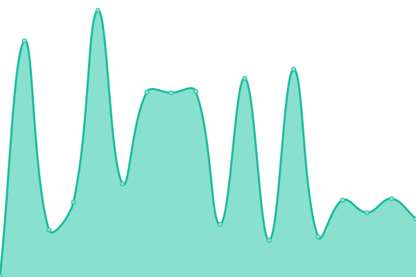 253ms
     
 | 

<a href="https://MBTechLabs.github.io/status/history/silikal">99.19%</a>
    

|  [HRD Venture Trade](https://hrd-venture-trade.com) | 🟩 Up | [hrd-venture-trade.yml](https://github.com/MBTechLabs/status/commits/HEAD/history/hrd-venture-trade.yml) | 

 1597ms
     
 | 

<a href="https://MBTechLabs.github.io/status/history/hrd-venture-trade">95.49%</a>
    

|  [Qteknos](https://www.qteknos.com) | 🟩 Up | [qteknos.yml](https://github.com/MBTechLabs/status/commits/HEAD/history/qteknos.yml) | 

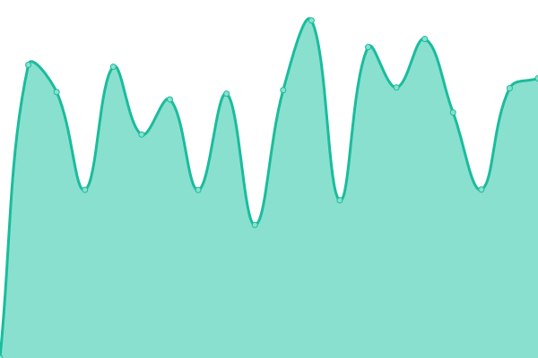 3609ms
     
 | 

<a href="https://MBTechLabs.github.io/status/history/qteknos">97.01%</a>
    

|  [Prada Setia](https://pradasetia.com) | 🟥 Down | [prada-setia.yml](https://github.com/MBTechLabs/status/commits/HEAD/history/prada-setia.yml) | 

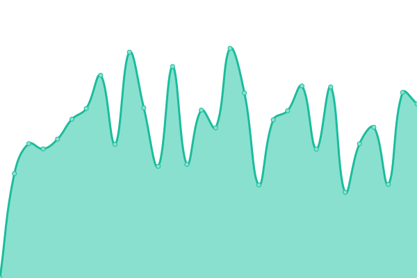 2248ms
     
 | 

<a href="https://MBTechLabs.github.io/status/history/prada-setia">0.00%</a>
    

|  [RMSP](https://rmsp.co.id) | 🟩 Up | [rmsp.yml](https://github.com/MBTechLabs/status/commits/HEAD/history/rmsp.yml) | 

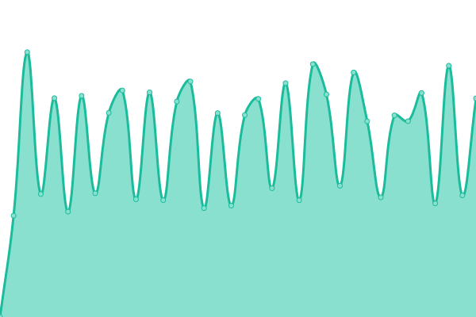 5776ms
     
 | 

<a href="https://MBTechLabs.github.io/status/history/rmsp">97.01%</a>
    

|  [Marvelo Leather](https://marveloleather.com) | 🟩 Up | [marvelo-leather.yml](https://github.com/MBTechLabs/status/commits/HEAD/history/marvelo-leather.yml) | 

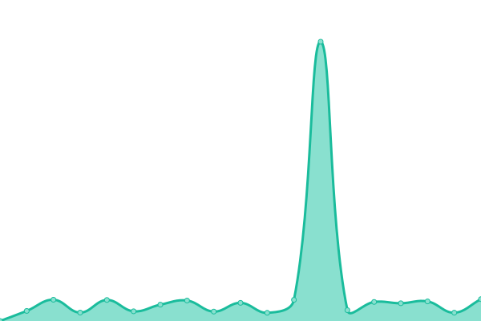 6721ms
     
 | 

<a href="https://MBTechLabs.github.io/status/history/marvelo-leather">99.30%</a>
    

|  [RDS Indo](https://rds.co.id) | 🟩 Up | [rds-indo.yml](https://github.com/MBTechLabs/status/commits/HEAD/history/rds-indo.yml) | 

 1871ms
     
 | 

<a href="https://MBTechLabs.github.io/status/history/rds-indo">100.00%</a>
    

|  [Mentari Freight](https://mentarifreight.com) | 🟩 Up | [mentari-freight.yml](https://github.com/MBTechLabs/status/commits/HEAD/history/mentari-freight.yml) | 

 1448ms
     
 | 

<a href="https://MBTechLabs.github.io/status/history/mentari-freight">100.00%</a>
    

|  [RDS Singapore](https://rds.sg) | 🟩 Up | [rds-singapore.yml](https://github.com/MBTechLabs/status/commits/HEAD/history/rds-singapore.yml) | 

 1425ms
     
 | 

<a href="https://MBTechLabs.github.io/status/history/rds-singapore">100.00%</a>
    

|  [RDS Vietnam](https://rdsvietnam.vn) | 🟩 Up | [rds-vietnam.yml](https://github.com/MBTechLabs/status/commits/HEAD/history/rds-vietnam.yml) | 

 1759ms
     
 | 

<a href="https://MBTechLabs.github.io/status/history/rds-vietnam">100.00%</a>
    

|  [Alpha MT](https://alpha-mt.com) | 🟩 Up | [alpha-mt.yml](https://github.com/MBTechLabs/status/commits/HEAD/history/alpha-mt.yml) | 

 484ms
     
 | 

<a href="https://MBTechLabs.github.io/status/history/alpha-mt">84.99%</a>
    

|  [Silverplas](https://silverplas.co.id) | 🟥 Down | [silverplas.yml](https://github.com/MBTechLabs/status/commits/HEAD/history/silverplas.yml) | 

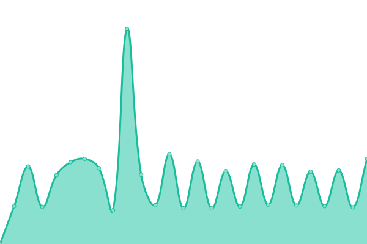 1094ms
     
 | 

<a href="https://MBTechLabs.github.io/status/history/silverplas">0.00%</a>
    

|  [Ispak](https://ispak.co.id) | 🟥 Down | [ispak.yml](https://github.com/MBTechLabs/status/commits/HEAD/history/ispak.yml) | 

 0ms
     
 | 

<a href="https://MBTechLabs.github.io/status/history/ispak">0.00%</a>
    

|  [Giga Solusi](https://gigasolusi.co.id) | 🟩 Up | [giga-solusi.yml](https://github.com/MBTechLabs/status/commits/HEAD/history/giga-solusi.yml) | 

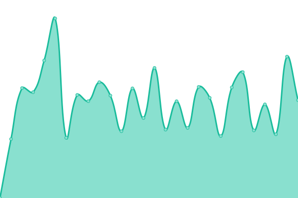 1902ms
     
 | 

<a href="https://MBTechLabs.github.io/status/history/giga-solusi">95.50%</a>
    

|  [Risman Hotel](https://therismanhotel.com) | 🟥 Down | [risman-hotel.yml](https://github.com/MBTechLabs/status/commits/HEAD/history/risman-hotel.yml) | 

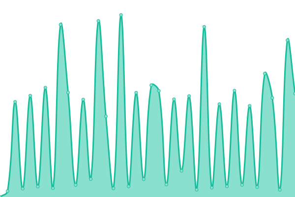 1574ms
     
 | 

<a href="https://MBTechLabs.github.io/status/history/risman-hotel">83.71%</a>
    

|  [Prodia OHI](https://prodiaohi.co.id) | 🟩 Up | [prodia-ohi.yml](https://github.com/MBTechLabs/status/commits/HEAD/history/prodia-ohi.yml) | 

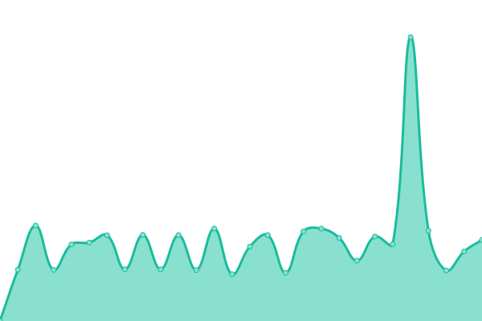 1338ms
     
 | 

<a href="https://MBTechLabs.github.io/status/history/prodia-ohi">97.00%</a>
    

|  [Tjajolaw](https://tjajolaw.id) | 🟩 Up | [tjajolaw.yml](https://github.com/MBTechLabs/status/commits/HEAD/history/tjajolaw.yml) | 

 2108ms
     
 | 

<a href="https://MBTechLabs.github.io/status/history/tjajolaw">97.00%</a>
    

|  [Blue Power Technology](https://www.bluepowertechnology.com) | 🟩 Up | [blue-power-technology.yml](https://github.com/MBTechLabs/status/commits/HEAD/history/blue-power-technology.yml) | 

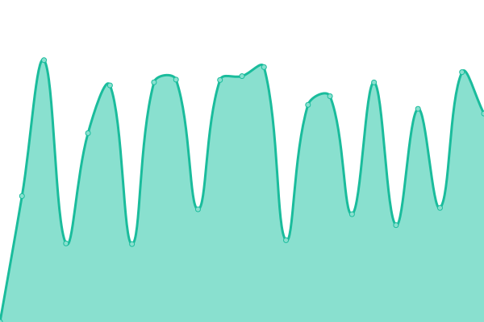 1408ms
     
 | 

<a href="https://MBTechLabs.github.io/status/history/blue-power-technology">97.00%</a>
    

|  [Ikarao](https://ikarao.id) | 🟥 Down | [ikarao.yml](https://github.com/MBTechLabs/status/commits/HEAD/history/ikarao.yml) | 

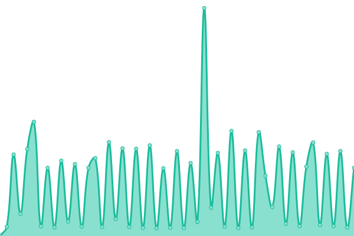 825ms
     
 | 

<a href="https://MBTechLabs.github.io/status/history/ikarao">83.71%</a>
    

|  [CV Anugerah Lestari](https://anugerahlestari.co.id) | 🟥 Down | [cv-anugerah-lestari.yml](https://github.com/MBTechLabs/status/commits/HEAD/history/cv-anugerah-lestari.yml) | 

 1524ms
     
 | 

<a href="https://MBTechLabs.github.io/status/history/cv-anugerah-lestari">96.58%</a>
    

|  [Hamparan Stone](https://hamparanstone.com) | 🟥 Down | [hamparan-stone.yml](https://github.com/MBTechLabs/status/commits/HEAD/history/hamparan-stone.yml) | 

 1471ms
     
 | 

<a href="https://MBTechLabs.github.io/status/history/hamparan-stone">84.02%</a>
    

|  [Stellarfm](http://stellarfm.com.au) | 🟥 Down | [stellarfm.yml](https://github.com/MBTechLabs/status/commits/HEAD/history/stellarfm.yml) | 

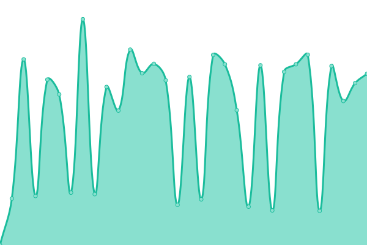 2317ms
     
 | 

<a href="https://MBTechLabs.github.io/status/history/stellarfm">96.75%</a>
    

|  [Majalah Sunday](https://majalahsunday.com) | 🟥 Down | [majalah-sunday.yml](https://github.com/MBTechLabs/status/commits/HEAD/history/majalah-sunday.yml) | 

 1617ms
     
 | 

<a href="https://MBTechLabs.github.io/status/history/majalah-sunday">84.03%</a>
    

|  [KPSG](https://kpsg.com) | 🟩 Up | [kpsg.yml](https://github.com/MBTechLabs/status/commits/HEAD/history/kpsg.yml) | 

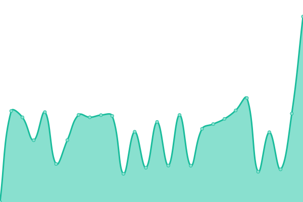 1278ms
     
 | 

<a href="https://MBTechLabs.github.io/status/history/kpsg">97.01%</a>
    

|  [Romeesa Design](https://romeesadesign.co.id) | 🟥 Down | [romeesa-design.yml](https://github.com/MBTechLabs/status/commits/HEAD/history/romeesa-design.yml) | 

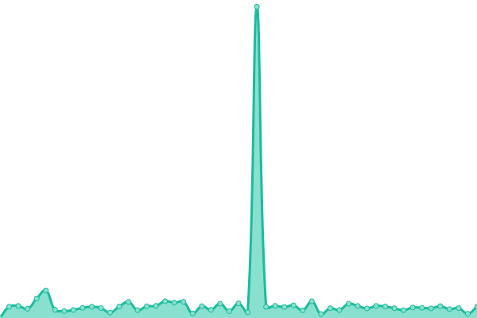 358ms
     
 | 

<a href="https://MBTechLabs.github.io/status/history/romeesa-design">84.03%</a>
    

|  [Jayananta Anugerah Sejati](https://jayanantaanugerahsejati.com) | 🟩 Up | [jayananta-anugerah-sejati.yml](https://github.com/MBTechLabs/status/commits/HEAD/history/jayananta-anugerah-sejati.yml) | 

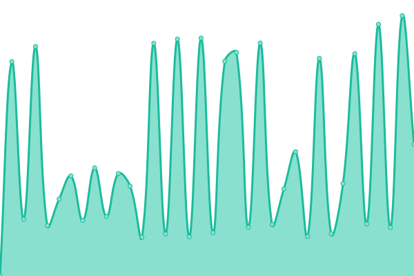 4773ms
     
 | 

<a href="https://MBTechLabs.github.io/status/history/jayananta-anugerah-sejati">95.31%</a>
    

|  [The Ahad](https://www.the-ahad.com) | 🟥 Down | [the-ahad.yml](https://github.com/MBTechLabs/status/commits/HEAD/history/the-ahad.yml) | 

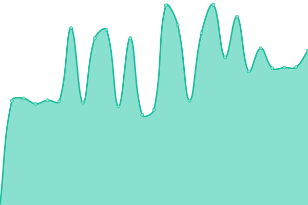 4943ms
     
 | 

<a href="https://MBTechLabs.github.io/status/history/the-ahad">84.04%</a>
    

|  [ARSI](https://arsi.ai) | 🟩 Up | [arsi.yml](https://github.com/MBTechLabs/status/commits/HEAD/history/arsi.yml) | 

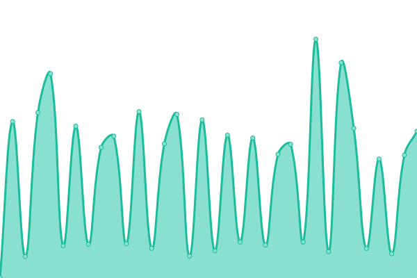 2621ms
     
 | 

<a href="https://MBTechLabs.github.io/status/history/arsi">96.82%</a>
    

|  [EGEROO](https://egeroo.ai) | 🟥 Down | [egeroo.yml](https://github.com/MBTechLabs/status/commits/HEAD/history/egeroo.yml) | 

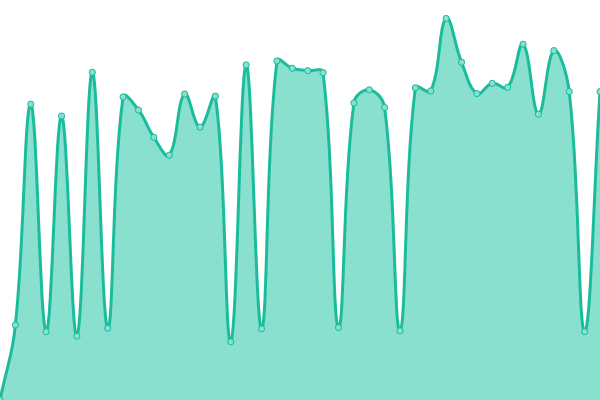 3295ms
     
 | 

<a href="https://MBTechLabs.github.io/status/history/egeroo">82.86%</a>
    

|  [PayPrime](https://payprime.com) | 🟩 Up | [pay-prime.yml](https://github.com/MBTechLabs/status/commits/HEAD/history/pay-prime.yml) | 

 1757ms
     
 | 

<a href="https://MBTechLabs.github.io/status/history/pay-prime">100.00%</a>
    

|  [Test Broken Site](https://thissitedoesnotexist.koj.co) | 🟥 Down | [test-broken-site.yml](https://github.com/MBTechLabs/status/commits/HEAD/history/test-broken-site.yml) | 

 0ms
     
 | 

<a href="https://MBTechLabs.github.io/status/history/test-broken-site">100.00%</a>
    

<!--end: status pages-->

[**Visit our status website →**](https://MBTechLabs.github.io/status)

## 📄 License

- Powered by: [Upptime](https://github.com/upptime/upptime)
- Code: [MIT](./LICENSE) © [Anand Chowdhary](https://anandchowdhary.com), supported by [Pabio](https://pabio.com)
- Data in the `./history` directory: [Open Database License](https://opendatacommons.org/licenses/odbl/1-0/)
